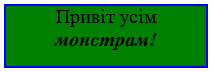

# Каскадні таблиці стилів (CSS)

Стилі можна підключити до елементу сторінки трьома способами:
1.  Всередині тегу прописати атрибут style, в якому задати необхідні стилі

```html
<div style="width: 100px; height: 100px; background-color: red;"></div>
```


2.  В розділ ```<head></head>``` додати тег ```<style></style>```, в середині якого прописати необхідні стилі.

```html
  <head>
    <style>
      #block {
        width: 100px;
        height: 100px;
        background-color: red;
      }
    </style>
  </head>
  ...
  <div id="block"></div>
```

3.  Прописати стилі в окремому файлі з розширенням _css_. Підключити цей файл за допомогою тегу ```<link>```  всередині розділу ```<head></head>```

_Файл **style.css**_ 

```css
#block {
  width: 100px;
  height: 100px;
  background-color: red;
}
```

_Файл **index.html**_

```html
<html>
  <head>
    <link rel="stylesheet" type="text/css" href="style.css">
  </head>
  <body>
    <div id="block"></div>
  </body>
</html>
```

## Селектори
Для того, щоб можна було ставити у відповідність стиль до якихось елементів на сторінці використовуються Селектори (Selectors)

Селектор в css | Код в html                                | Опис
-------------- | ----------------------------------------- | ------------------------------------
```#name```    | ```<div id ="name">``` ```<table id="name">```   | Ідентифікатор елементу. У кожного елементу може бути унікальний ідентифікатор
```.name```    | ```<div class="name">``` ```<table class = "name">``` | Клас. У багатьох елементів може бути один і той же клас
```tag_name``` | ```<tag_name>``` | Селектор тегів. Стиль буде застосовуватися до усіг тегів

## Завдання ( використовувати лише теги ```<div>```)

Створити зелений квадрат шириною 200 px  та висотою 60px. Додати неперервну синю рамку навколо квадрату товщиною 2 px. Додати текст  та зробити його шрифтом Times New Roman  розміром 20px. Останнє слово зробити жирним та курсивом:

