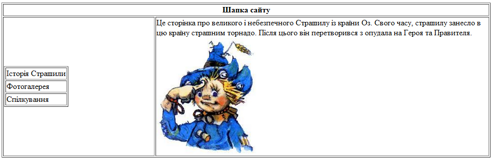

# Каскадні таблиці стилів №2  (CSS)

Додайте на html-сторінку елемент div  з текстом:.

```html
<div id="victory"> Перемога!</div>
```

За допомогою лише CSS виконати наступні дії:
**Завдання:**

1.  Додати жовтий фон;
2.  Додати зелену пунктирну границю, шириною в 2пх зліва;
3.  Додати червону неперервну границю, шириною в 3пх справа;
4.  Додати чорну штрихову границю, шириною в 1пх знизу;
5.  Встановити висоту блоку в 50пх, а ширину в 300пх;
6.  Зробити, щоб блок відступав від лівої сторони сторінки на 20пх, а від верхньої сторони на 100пх;
7.  Знайти/створити картинку розміром 20пх на 20пх та встановити її як фоновий малюнок;
8.  Замостити малюнок по усьому блоці;
9.  Змінити режим  замощення та замостити його лише по осі Х;
10. Змінити режим замощення та замостити його лише по осі Y;
11. Поставити режим «без повторення фонового малюнку» та розмістити фоновий малюнок в правому нижньому кутку;
12. Зробити, щоб від лівого краю блоку до тексту був відступ 20пх, а від верхнього краю блоку до тексту був відступ 10пх;
13. Центрувати текст по по горизонталі;
14. Зробити, щоб текст був центрований по вертикалі;
15. Встановити шрифт тексту Verdana, розміру 25пх;
16. Встановити колір тексту – Зелений;
17. Зробити текст жирним, підкреслити його та зробити курсивом;
18. Зробити, щоб усі букви тексту були лише заголовочними;
19. Збільшити відстань між буквами вдвічі;
20. Додати іще один div з шириною 200х200 пх та червоним фоном та розмістити його так, щоб його верхній лівий кут мав координату (100 пх, 200пх);
21. Додати іще один div з шириною 200х200 пх та синім фоном та розмістити його так, щоб його верхній лівий кут мав координату (200 пх, 300пх);
22. Не змінюючи html-код зробити, щоб  червоний блок був розташований найвище;
23. Додати в червоний блок картинку розміром 300х300 пх;
24. Зробити, щоб картинка обрізалася по границям блоку;
25. Зробити, щоб картинка у червоному блоці була на 50% прозора;
26. Зробити, щоб синій блок став невидимим.
27. Додати таблицю 3х3 та додати границю до таблиці та комірок чорною неперервною лінією 1пх.
28. Кожній комірці таблиці задати свій колір фону.
29. Зробити, щоб перша колонка таблиці мала ширину 30%, а друга 300пх. Ширину усієї таблиці задати як 100%.
30. Зробити, щоб в центральній комірці границя стала синьою штрих-пунктирною із товщиною 2пх.

Створити таблицю 2х2 шириною на усю сторінку. Верхні комірки повинні бути об’єднані. У лівій нижній комірці повинна 
бути інша таблиця з трьома комірками (меню). У правій нижній комірці повинен бути коротка стаття  про Страшилу з малюнком.

