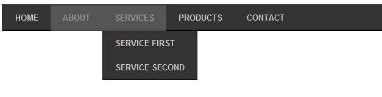
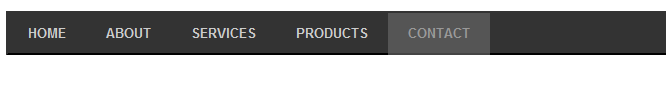
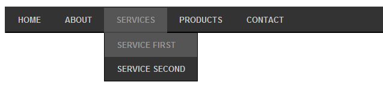

# Випадаюче меню

1.  Используя полученные знания по HTML и CSS, необходимо создать меню, которое будет иметь следующий вид:

При этом серым фоном выделяется ссылка, на которую пользователь нажал мышкой.
Все пункты меню указывают на ту же самую страницу, то есть href = “#”;
Все буквы приведены к верхнему регистру с помощью свойства CSS. 
Основные параметры: 
+ Цвет фона меню: #333
+ Шрифт: 13пх, жирный
+ Высота меню: 40пх
+ Левая и верхняя границы:
  * цвет: #333
  * ширина: 2пх
  * тип линии: сплошная
+ Правая и нижняя: ширина и тип линии такой же, цвет: #000.
+ Стиль активной ссылки:
  * Цвет  фона: #555
  * Цвет текста: #999
  * Нижняя граница:
    - цвет: #444
    - ширина: 2пх
    - тип линии: сплошная

2.  При наведении на любой другой пункт меню он принимает следующий вид:

* Пункт, на который наведен указатель мыши, имеет такой же стиль, как и активная ссылка.
* Если у пункта есть подпункты, они становятся видимыми. Весь блок с подпунктами имеет черную рамку шириной в 1пх (слева, снизу и справа).

3.  Используя JavaScript, обработать нажатие на пункты меню.
* По нажатию на один из главных пунктов меню все другие пункты становятся не активными, а нажатый становится активным. Например, если нажать на «Contact», меню примет следующий вид:

* По нажатию на вложенный пункт меню, активным становится тот главный пункт, к которому он принадлежит. Например, по нажатию на «SERVICE FIRST» меню примет вид:

