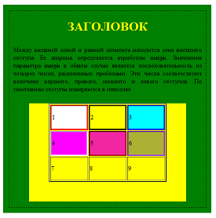
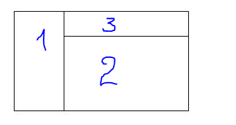
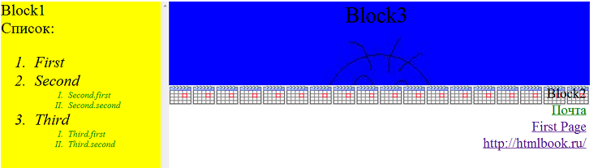

# Контрольне заняття CSS та HTML.

Все стили необходимо прописывать во внешнем файле таблиц стилей, который подключать к html-документу.

1.  Создать зеленый квадрат по центру страницы размером 500х500px.
2.  Создать пунктирную рамку внутри зеленого квадрата с отступом от краев 15px.
3.  В квадрате создать заголовок h1 и текст, используя для них разные размеры и типы шрифтов.
4.  Добавить желтый блок, который частично перекрывает зеленый (использовать z-index).

5.  Создать таблицу 3х3, и для каждой ячейки задать в стилях разные фон и цвет границ.
6.  Создать новый блок и разместить в нем 3 блока следующим образом:

7.  В 1-ый  блок добавить нумерованный список с 2 уровнями вложенности. Создать по одному стилю для каждого из уровней и применить их.
8.  В 3 блоке разместить рисунок
9.  Во 2 блок добавить 3 ссылки:
  * Если ссылка еще не была посещена, то ее стиль – зеленый цвет шрифта, без подчеркивания.
  * При наведении на ссылку, ее цвет меняется на красный, а фон – на серый и буквы все становятся большими.
  * Если ссылка уже была посещена, то ее фон должен быть желтым.
10. Для второго блока установить фоновое изображение (установить повторение рисунка по горизонтали).
11.	В блоке 1 при наведении на элементы списка менять указатель мыши на «».
12.	 Для блока 1 сделать так, чтобы всегда отображалась вертикальная полоса прокрутки.

13.	Добавить исключение для браузера IE6. Для него выводить на экран прямоугольный блок, выровненный по центру с текстом внутри «Обновите браузер на более новую версию».
