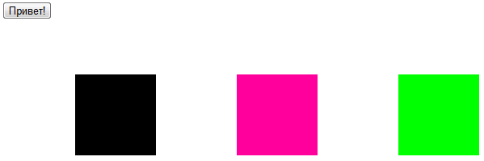
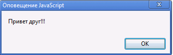
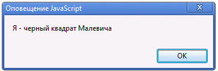
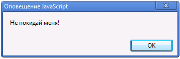
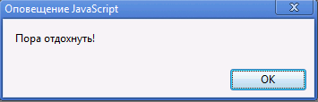

# Задания по Javascript №1

1.  На страничке расположить кнопку «Привет» и три квадрата – черный, розовый и зеленый. 

* Сразу после загрузки страчики должно возникать сообщение «Меня загрузили!!»
* По нажатию на кнопку должно появляется оповещение– «Привет друг!!!»
* При наведении мышки на черный квадрат, должно возникать сообщение «Я - черный квадрат Малевича».
* Если курсор мышки выходит за границы розового квадрата должно возникать сообщение «Не покидай меня!».
* По двойному нажатию на зеленый квадрат, должно появиться сообщение «Мир во всем мире!»

